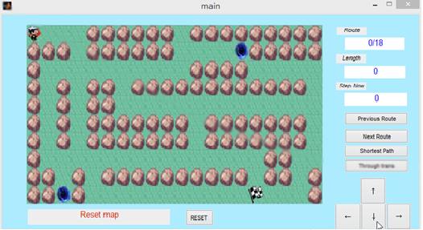

# Matlab-Maze
+ 使用Matlab製作之簡易老鼠走迷宮<br>
+ 含GUI，使用滑鼠操作<br>



**涵蓋功能：**  
1. 自動計算該迷宮地圖可行之路徑數，使用Previous Route與Next Route選擇路徑 
2. 自動計算最短路徑數，點擊 Shortest path 即可   
3. 自動計算使用傳送門之最短路徑數，點擊 Through doors 即可 
4. 使用滑鼠點擊方向鍵移動   
5. 顯示目前狀態於最下方 
6. 點擊 Reset，回到初始狀態   


**為正確編譯：**  
迷宮之載入僅需更改 line67 及 line72 之fopen路徑位置即可  
```mazeFile = fopen('\maze\maze.txt');```  
> 已提供數個迷宮檔案位於 Folder : maze中  

路徑之計算使用「深度優先搜尋」，檔案為DFS_maze2 
- - -
> 本專案為 CE2004A程式語言：期末專案<br>
> 與104502529共同製作
